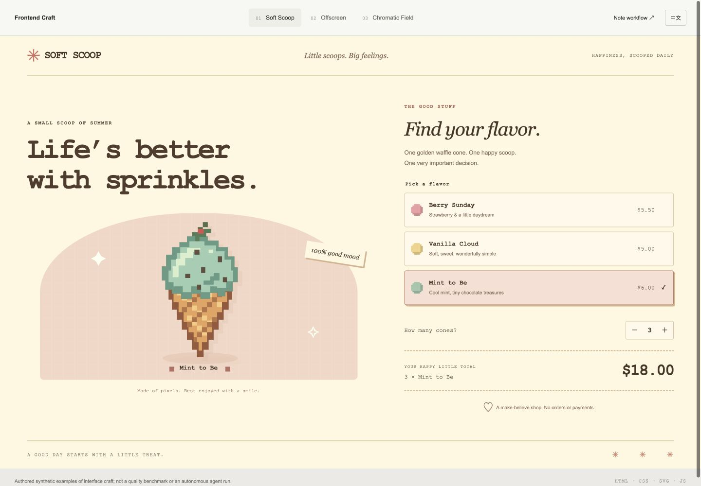
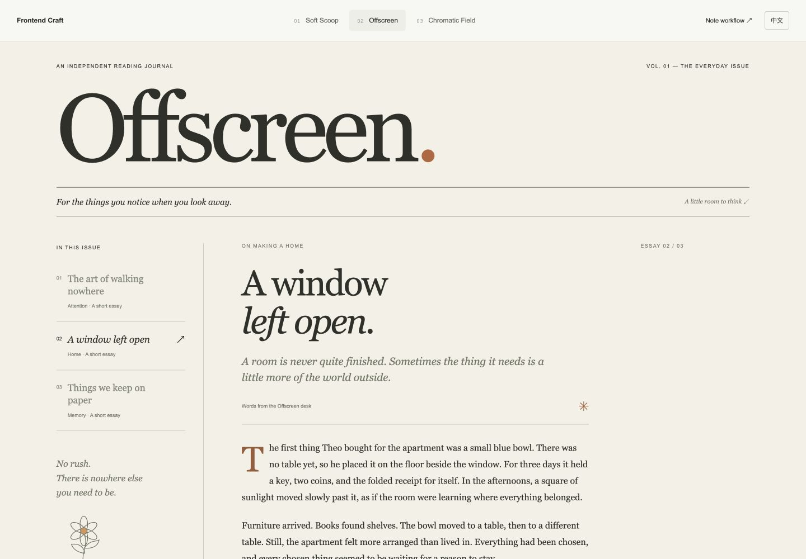
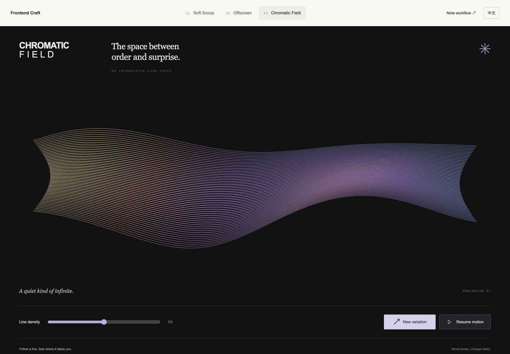
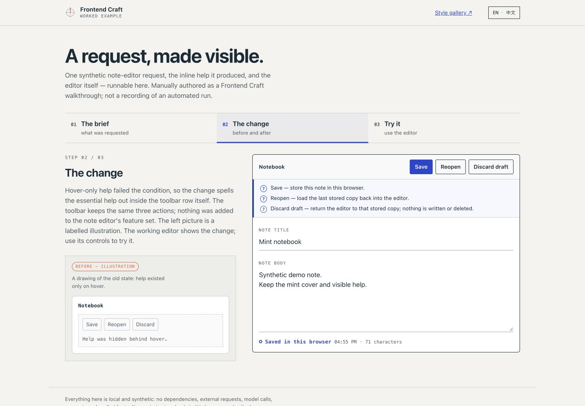
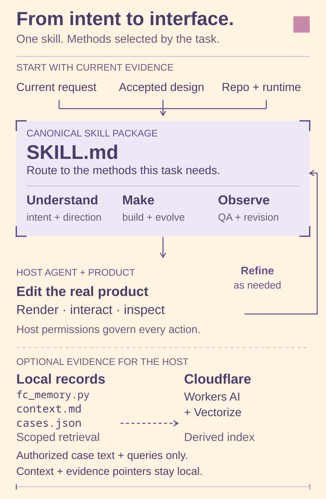

# Frontend Craft

[English](README.md) · [中文](README.zh-CN.md)


Frontend Craft (FC) is Faye & Cove's design-engineering method family for
frontend interfaces and code-rendered visual works. It is one skill that routes
to focused methods for understanding a request, forming a direction, building,
evolving, repairing, recording, and visually checking real interfaces.

It is for people building or maintaining a real product surface — apps, pages,
components, flows, and the visual works a product produces — including anyone
who wants a design-aware change without a full redesign. It is not a template
generator and does not need generated concept art to begin.

The aim is a visually compelling, usable first result, revisions that fix the
cause without losing accepted work, and less repeated correction as relevant
experience accumulates. Those are design goals, not measured improvement claims.

The English edition is canonical. The [Chinese edition](README.zh-CN.md)
maintains the same capabilities, commands, boundaries, and rights in Chinese.

## What it does

- **Build from real content.** Create a page, component, app shell, or flow from
  the product's actual content and purpose, not placeholder data or fashionable
  scaffolding.
- **Implement from a reference.** Follow a screenshot, mockup, Figma export, or
  declared visual target while keeping the app's real behavior.
- **Evolve an existing product.** Add a capability or accommodate growth without
  breaking unaffected promises or user work.
- **Repair a specific defect.** Trace a broken UI promise through actions,
  requests, stored facts, and reopened views to its real owner.
- **Revise from feedback.** Diagnose the cause of “this works but feels
  confusing”, “too empty”, or “fix the spacing, keep the artwork”, and preserve
  what was already accepted. Trace related instances of a rejected treatment
  and choose separately how widely to repair and how deeply to recompose.
- **Review only.** Inspect source and rendered behavior and report located
  findings without editing anything.

Methods load only when they affect the current task, so a clear small fix stays
a small fix.

Choose typography, code-native graphics, photography, or other media from the
content and experience; drawing with code is not a fallback after asset search.
Required references and brand assets retain their authority. ImageGen is
opt-in: use it only when generated imagery is explicitly requested
or a concrete required raster asset is explicitly approved.

## Install

This repository is the canonical source and the installable skill package: the
repository root is the skill directory. Installation reads the published
repository revision. The core skill needs no Python and no Cloudflare; optional
helpers below use Python.

Ask Codex to install the skill from:

```text
https://github.com/IndelibleVivi/frontend-craft
```

Or use Codex's bundled skill installer:

```bash
python3 "${CODEX_HOME:-$HOME/.codex}/skills/.system/skill-installer/scripts/install-skill-from-github.py" \
  --repo IndelibleVivi/frontend-craft \
  --path . \
  --name frontend-craft
```

The installer intentionally stops if a `frontend-craft` directory already
exists at the destination; it does not overwrite or upgrade an installed copy,
and the bundled script has no upgrade verb. For updates, preserve any local
edits, review the new revision, and ask Codex to update the installed copy;
rerunning the command above will stop at the existing destination. After
installation, start a fresh Codex task or reload skill discovery before
evaluating activation.

## Use

One natural request is enough — no method name is required. A concrete example
prompt (the note editor and its details are illustrative):

```text
Use $frontend-craft to add essential inline help to this note editor's toolbar,
visible on narrow screens without a hover. Preserve the existing note text,
controls, and artwork, and use the current stack. Verify editing, saving, and
reopening a note, keyboard focus, and both a wide and a narrow viewport. Do not
use ImageGen unless I explicitly approve a required generated asset.
```

Other requests route themselves: “this works but feels confusing — repair the
controls and preserve the artwork”, “help me choose a direction from this
content”, or “review this page without editing it”.

This is an example of the kind of prompt FC handles; it is not a result the
skill has produced. Expect the complete requested surface rather than a shell,
a static mock, or inert controls, with rendered evidence proportional to
the change. Source, build, rendered behavior,
deployment, and your own acceptance remain separate claims, and you remain the
authority on acceptance.

## Explore the examples

Start with the [interactive style gallery](examples/showcase/README.md): a
pixel ice-cream shop, a reading journal, and a generative visual studio. Each
has a different composition and real controls. The
[pixel banner collection](docs/visuals/README.md) shows the repository's own
ice-cream palette; it is not a style imposed on other products.

For a specific making problem, open the
[choice-and-result study](examples/showcase/README.md#making-study-choice-and-result).
Try how visible options relate to their immediate result, then change content
length and option count. The source and counterexample explain when to borrow
that relationship; the study is not an owner-approved style or quality benchmark.

| Soft Scoop · pixel shop | Offscreen · reading journal | Chromatic Field · procedural art |
| --- | --- | --- |
| [](examples/showcase/README.md) | [](examples/showcase/README.md) | [](examples/showcase/README.md) |

**A request, made visible.** Follow one synthetic note-editor change from the
brief to visible inline help, then edit, save, discard a draft, and reopen a
note yourself. Switch between English and Chinese without changing your note.

[](examples/workflow/README.md)

Run from the repository root with Python 3:

```bash
python3 -m http.server 4182 --bind 127.0.0.1
```

Then open the [style gallery](http://127.0.0.1:4182/examples/showcase/) or the
[note workflow](http://127.0.0.1:4182/examples/workflow/) in your browser.
The demos have no
dependencies, model calls, accounts, or external requests. Saved notes stay in
this browser; a refused write retains an explicitly page-only copy, with a
restore action if reopening a different browser-saved note displaces it. Read
failures preserve the draft and recovery copy, and later actions retry storage.
The illustrated “before” and the working editor are
manually authored examples, not a recorded autonomous FC run or a quality
benchmark. See the [walkthrough and storage details](examples/workflow/README.md).

## Method navigation



The arrows describe guidance and feedback, not a mandatory execution pipeline.
The [visual language and architecture source map](docs/visuals/README.md)
explain the relationships and the editable artwork.

[SKILL.md](SKILL.md) is the daily entrypoint and owns routing and the shared
contract. The references own focused methods; each has its own trigger, and
they are not a mandatory pipeline or separately installed skills. Grouped by
intent:

- **Understand the request:** [decipher intent](references/intent-decipher.md),
  [design direction](references/design-direction.md).
- **Make the change:** [build](references/build.md), [evolve](references/evolve.md),
  [visual construction](references/visual-construction.md),
  [app interaction](references/app-interaction.md).
- **Trace and fix:** [state and contracts](references/state-contracts.md),
  [critique and revision](references/critique-revision.md).
- **Record and learn:** [design learning](references/design-learning.md),
  [memory operations](references/memory-operations.md).
- **Produce and verify:** [visual works](references/visual-works.md),
  [platform evidence](references/platform-evidence.md),
  [QA contract](references/qa-contract.md),
  [interface scenarios](references/interface-scenarios.md).

## Optional records and data flow

FC works from the current request, the project's design authority, and the
rendered runtime. Everything below is optional, for maintainers who
deliberately keep scoped design records.

Personal context, case catalogs, credentials, configuration, sync state, raw
sessions, and evaluation traces stay **outside this package**. If you keep a
scoped record, the method is in
[design learning](references/design-learning.md); the record format and
day-to-day procedures are in [memory operations](references/memory-operations.md).
On Codex, an operator who has deliberately created scoped personal design
context may keep it at
`${CODEX_HOME:-$HOME/.codex}/private-continuity/frontend-craft/context.md`; it
is read in full only for relevant design or revision work, only when present,
and it stays outside this package. The package never mines chat history, sweeps
private directories, or collects a background memory.

**Local helper (offline).** [`scripts/fc_memory.py`](scripts/fc_memory.py) is a
Python-standard-library tool over an explicitly supplied private root. It
returns the whole current context plus bounded candidates and never infers,
rewrites, or promotes preferences. Lexical queries need no service:

```bash
python3 scripts/fc_memory.py query --root "<authorized-root>" \
  --project "<project-slug>" --surface "<surface-name>" --term "<keyword>"
```

**Cloudflare semantic recall (optional, network).**
[`scripts/fc_cloudflare.py`](scripts/fc_cloudflare.py) adds semantic recall over
the same local records: Workers AI embeds a small allowlisted slice of each
case and Vectorize stores derived vectors plus compact metadata. The canonical
records stay local and remain the only source of truth; the remote index is
rebuildable derived state. This path needs explicit setup and explicit
data-transfer authorization, and synchronization shows a dry-run plan before
`--apply`. Cloudflare receives allowlisted case retrieval text and
natural-language queries for embedding; current context and evidence pointers
stay local, and no preference data ships in this repository. See
[Cloudflare memory](references/cloudflare-memory.md).

A synthetic offline walkthrough of the helper, using only fictional cases, is
in [examples/README.md](examples/README.md). It demonstrates retrieval
boundaries, not design quality or real feedback. Choose your own authorized
record directory **outside this repository**; never edit the public fixture into
a private profile.

## Evidence and limitations

- **Goals, not measured results.** A stronger first result and less
  rework are intended outcomes, not a demonstrated improvement rate.
- **Tests do not prove design quality.** Package validity and passing helper
  tests show conformance, not first-draft quality, aesthetic acceptance, or
  user satisfaction. A synthetic example or agent self-review proves neither.
- **No bundled tooling.** No browser, device lab, image generator, font bundle,
  native automation adapter, evaluation service, or automatic screenshot-baseline approval ships here;
  rendered checks use the tools a project already has. A browser screenshot
  cannot verify a native app or an actual export.
- **Skills guide; they do not enforce.** A skill shapes agent behavior. It is
  not a sandbox and does not guarantee a host loaded or followed the updated
  instructions.
- **Separate evidence layers.** Source, build, rendered runtime, deployment, and
  owner acceptance are never collapsed into one claim.

For substantial method changes, the [synthetic forward cases](references/behavior-cases.md)
provide concrete challenges; they are a scenario menu, not a published success rate.

## Contributing and checks

Source and accepted documentation changes belong here; read
[AGENTS.md](AGENTS.md) first. The repository root is the installable skill
directory — keep it intact so relative references stay portable, and keep new
rules with their existing owners rather than copying them into new leaves.
Update both README editions when the shared contract changes.

```bash
python3 -m unittest discover -s tests -p 'test*.py'
node tests/test_workflow_app.js
```

These run the offline helper/public-memory-example tests and the workflow
demo's actual JavaScript with DOM/storage doubles. The latter requires Node.js
and does not render a browser. The [CI workflow](.github/workflows/ci.yml) runs
the Python suite on Python 3.13 and the workflow checks on the runner's Node.js,
with read-only contents permission and no secrets or live Cloudflare calls; its
result does not establish skill activation, rendered design quality, or live
service readiness. For skill or package changes, run `skill-validate .` when
available, then check reference links and `git diff --check` for changed
documentation.

## Source, ownership, and rights

This repository is the canonical source (`main`) and the installable package.
Installed copies and discovery links are separate layers about the same source,
not alternative owners: an installed copy can lag and needs a deliberate
update, and a discovery link follows whatever revision it resolves to. Report
source, published commit, installation, actual execution, and owner acceptance
separately. Historical mechanism provenance and external-source review are
recorded in [references/lineage.md](references/lineage.md).

FC is **source-available, not open source under an OSI-approved license**.
Project-original material is offered under two layered licenses: functional
skill instructions, method references, configuration, scripts, tests,
synthetic record data, and interactive example code under [SUL-1.0](LICENSE);
and explanatory
documentation and visual assets — README files, banners, architecture diagrams,
demo screenshots, the lineage, and licensing notices — under
[CC BY-NC-SA 4.0](LICENSE-DOCUMENTATION.md). [LICENSING.md](LICENSING.md) is the
authoritative path map and holds the exact scope. Upstream sources retain their
own terms, and links or acknowledgements do not relicense them.
