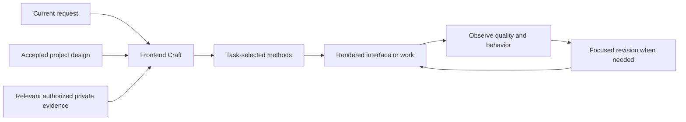

# Frontend Craft

Frontend Craft is Faye & Cove's design-engineering method family for frontend
interfaces and code-rendered visual works. One discoverable skill routes to
focused methods for direction, App interaction, critique and revision, design
records, visual works, and rendered verification. The aim is a useful first
result and fewer corrections that miss the cause or lose accepted work. These
are design goals, not a measured improvement claim.

It starts from the product, real content, accepted design or reference, and
rendered runtime. Generated concept art is not a prerequisite. A clear small
repair stays a small repair; methods load only when they affect the work.

## What it protects

- ImageGen is opt-in. It is used only when generated imagery is explicitly
  requested or a concrete raster-asset gap is explicitly approved.
- Existing products keep their real architecture, behavior, data, routes,
  semantics, and accepted visual system unless a replacement is authorized.
- Reference-led work treats the reference as visual authority and the running
  product as behavior authority.
- Net-new design connects purpose and real content to attention, composition,
  density, typography, material, and interaction. Resolve the decisive quality
  early, then complete the whole requested surface.
- A specific visual goal stays explicit through reference interpretation,
  rendered gap diagnosis, implementation, and comparison. Translating a visual
  language and exactly replicating a reference are different contracts.
- Stateful App work makes the current object, action scope, feedback, and
  recovery clear. View state, drafts, committed work, and outputs retain their
  intended ownership; whole-App requests cover the actual task journeys.
- Feedback-driven revision diagnoses the cause, preserves accepted qualities,
  and rechecks the original problem. Repeated complaints reopen the diagnosis.
- Project design decisions, personal preferences, and portable methods have
  separate homes. Explicit current direction wins over inferred taste; praise,
  dislike, and temporary compromise retain their scope and evidence.
- Authoring tools and their output are judged separately. Exports are checked
  as exports, and temporal works across time, not just one attractive frame.
  Visual studies return useful capabilities to the product's canonical path;
  manually improved samples do not prove automatic generation quality.
- Completion needs rendered evidence proportional to the change, including
  the intended quality and the cues for understanding a task. The detailed
  browser contract covers responsive layout, interaction, focus, and runtime.
- Source, build, rendered runtime, deployment, and owner acceptance remain
  separate claims.

## Method map

The daily entry is [SKILL.md](SKILL.md). Each method has a distinct trigger;
they are not a mandatory pipeline or separate installed skills.

| Method | Use when |
| --- | --- |
| [Design direction](references/design-direction.md) | Forming a new direction, composing from content, resolving a consequential design choice |
| [App interaction](references/app-interaction.md) | Designing stateful flows, object/action semantics, direct manipulation, recovery, and complete task journeys |
| [Critique and revision](references/critique-revision.md) | Diagnosing an unsatisfying render or making a feedback-driven correction |
| [Design records and learning](references/design-learning.md) | Maintaining accepted project decisions and scoped reusable experience |
| [Visual works](references/visual-works.md) | Producing or editing share graphics, procedural/temporal works, or editor outputs |
| [Platform evidence](references/platform-evidence.md) | Choosing a non-Web, shell, canvas, or export validation path; handling missing tools |
| [QA contract](references/qa-contract.md) | Checking the real interface, comprehension cues, positive quality, and regressions |



Project `DESIGN.md` or an established equivalent owns accepted product choices
and points to code-owned tokens. Personal feedback stays in an authorized
private location; the package provides a maintenance method, not a background
memory collector. Nothing automatically uploads, synchronizes, or publishes
preference records. Skills guide agent behavior; they do not enforce a sandbox.

For Codex operators who maintain scoped personal design context, the optional
entrypoint is `${CODEX_HOME:-$HOME/.codex}/private-continuity/frontend-craft/context.md`.
It is read for relevant design/revision work only when present, stays outside
this package, and does not authorize historical chat mining. Other hosts can
use an explicitly designated private location. See
[design learning](references/design-learning.md) for scope and maintenance.

The platform contract supports transferable judgment but does not ship a native
automation adapter. A browser screenshot cannot verify a native app or actual
export. Native document/deck/image production continues through its appropriate
artifact tool or skill. No browser, device lab, font bundle, image generator,
or persistent preference database is included.

Maintainer-only [forward cases](references/behavior-cases.md) distinguish
structural validation from observed behavior. The [lineage](references/lineage.md)
records field mechanisms and primary sources. Neither a synthetic example nor
agent self-review establishes human aesthetic acceptance or lower rework rates.

## Install for evaluation or authorized use

In the private workshop, this directory is canonical source. Existing discovery
links to it see source edits directly; separately copied installations require
an authorized update. Validate the source/discovery path with the installed
`skill-validate <skill-directory>` command when available, or the host's bundled
skill validator. Read back the resolved path before claiming installation.

The dedicated public projection is distributed separately and may lag this
workshop revision. The command below installs the published snapshot, not
necessarily the method family described by the current workshop source:

Ask Codex to install the skill from:

```text
https://github.com/IndelibleVivi/frontend-craft
```

Or use Codex's bundled skill installer:

```bash
python3 "${CODEX_HOME:-$HOME/.codex}/skills/.system/skill-installer/scripts/install-skill-from-github.py" \
  --repo IndelibleVivi/frontend-craft \
  --path . \
  --name frontend-craft
```

The installer intentionally stops if `frontend-craft` already exists in the
destination. After installation, start a fresh Codex task or reload skill
discovery before evaluating activation.

## Use

```text
Use $frontend-craft to build this interface from the repo's real product,
design, and runtime authority. Do not use ImageGen unless I explicitly approve
a required generated asset.
```

Other natural requests include “this works but feels confusing; repair the
controls and preserve the artwork,” “help choose a direction from this content,”
and “review this page without editing.” No separate method name is necessary.

## Repository shape

The repository root is the installable skill directory:

```text
README.md
SKILL.md
agents/openai.yaml
references/qa-contract.md
references/design-direction.md
references/app-interaction.md
references/critique-revision.md
references/design-learning.md
references/visual-works.md
references/platform-evidence.md
references/behavior-cases.md
references/lineage.md
```

Keep the directory intact when packaging so relative references stay portable.
An independent skill entry is warranted when a method repeatedly has its own
user request and acceptance boundary. Splitting entrypoints is not required to
use the methods, and must not create duplicated rule owners or a multi-skill
ritual for ordinary edits.

## Rights

Public visibility makes this source inspectable, but no copyright license has
been granted yet. The installation instructions document the package boundary;
they are not themselves permission to copy, redistribute, or publish modified
versions. A future LICENSE must be an explicit maintainer decision.
