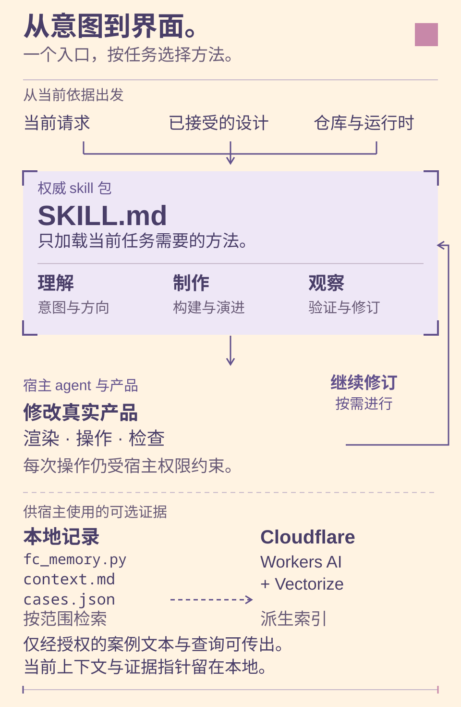

# Frontend Craft

[English](README.md) · [中文](README.zh-CN.md)


Frontend Craft（FC）是 Faye & Cove 为前端界面与代码渲染视觉作品维护的设计工程方法集合。一个 skill 入口按任务加载具体方法，覆盖理解需求、确定方向、构建、演进、修复、设计记录，以及真实界面的视觉验证。

它面向正在构建或维护真实产品界面的人——应用、页面、组件、流程，以及产品产出的视觉作品——也包括只想要一次懂设计的改动、而非整体重做的人。它不是模板生成器，也不需要先生成概念图才能开始。

它追求的是一个可用的首个结果，以及解决根因、不丢失已认可成果的修改。这些是设计目标，不是经过测量的改进声明。

英文版是权威版本。本[中文版](README.zh-CN.md)以中文维护同一套能力、命令、边界与权利。

## 它能做什么

- **基于真实内容构建。** 依据产品真实的内容与意图，创建页面、组件、应用外壳或流程，而不是占位数据或流行的脚手架。
- **按参考实现。** 依据截图、设计稿、Figma 导出或明确的视觉目标实现，同时保持应用的真实行为。
- **演进已有产品。** 新增能力或容纳增长，同时不破坏未受影响的承诺与用户成果。
- **修复具体缺陷。** 沿着操作、请求、存储事实与重新打开的视图，把一个失效的界面承诺追踪到真正的归属方。
- **依据反馈修改。** 诊断“能用但很困惑”“太空了”“修一下间距，保留美术”背后的原因，并保留已被认可的部分。
- **仅评审。** 检查源码与渲染行为，报告可定位的发现，不做任何改动。

方法只在影响当前任务时加载，因此一个清晰的小修复就保持为小修复。

ImageGen 是可选路径：仅在明确要求生成图像，或明确批准生成某个确实需要的 raster 素材后使用。

## 安装

本仓库既是权威源，也是可安装的技能包：仓库根目录就是技能目录。安装读取的是已发布的仓库修订。核心技能无需 Python，也无需 Cloudflare；下方可选助手才使用 Python。

让 Codex 从以下地址安装该技能：

```text
https://github.com/IndelibleVivi/frontend-craft
```

或使用 Codex 内置的技能安装器：

```bash
python3 "${CODEX_HOME:-$HOME/.codex}/skills/.system/skill-installer/scripts/install-skill-from-github.py" \
  --repo IndelibleVivi/frontend-craft \
  --path . \
  --name frontend-craft
```

如果目标位置已存在 `frontend-craft` 目录，安装器会刻意停止，不会覆盖或升级已安装的副本，该脚本也没有升级命令。更新时应先保留本地改动、查阅新修订，再让 Codex 更新已安装的副本；直接重跑上面的命令会因为目标已存在而停止。安装后，请新开一个 Codex 任务，或重新加载技能发现，然后才评估技能是否被激活。

## 使用

一句自然请求就够了——无需说出方法名。一个具体的示例提示词（笔记编辑器及其细节均为示意）：

```text
用 $frontend-craft 为这个笔记编辑器的工具栏加上必要的行内帮助，在窄屏上无需悬停
即可见。保留现有的笔记文本、控件与美术，沿用当前技术栈。验证编辑、保存与重新打开
笔记，验证键盘焦点，并覆盖宽屏与窄屏两个视口。除非我明确批准某个必需的生成素材，
否则不要使用 ImageGen。
```

其他请求会自行路由：“能用但很困惑——请修复这些控件并保留美术”“帮我从这些内容里选一个方向”“只评审这个页面，不要改动”。

以上是 FC 能处理的一类提示词示例，不是该技能已产出的结果。预期得到的是完整的、被请求的界面，而不是外壳、静态稿或无效控件；交付应提供与改动相称的渲染证据。源码、构建、渲染行为、部署，以及你自己的认可，始终是相互区分的声明，而认可与否的权威仍然是你。

## 亲手试试这些示例

先看[可交互的风格展示](examples/showcase/README.md)：像素冰淇淋店、阅读刊物，以及生成式视觉工作台。每个场景都有不同的构图与真正可用的控件。[像素 banner 合集](docs/visuals/README.md)展示的是仓库自己的冰淇淋配色，不要求其他产品也采用同一风格。

| Soft Scoop · 像素小店 | Offscreen · 阅读小刊 | Chromatic Field · 程序艺术 |
| --- | --- | --- |
| [](examples/showcase/README.md) | [](examples/showcase/README.md) | [](examples/showcase/README.md) |

**让请求变得可见。** 沿着一个合成笔记编辑器的改动，从需求看到行内帮助，再亲手编辑、保存、丢弃草稿与重新打开笔记。切换中英文不会改写你的笔记内容。

[](examples/workflow/README.md)

在仓库根目录用 Python 3 运行：

```bash
python3 -m http.server 4182 --bind 127.0.0.1
```

然后在浏览器打开[风格展示](http://127.0.0.1:4182/examples/showcase/)或[笔记工作流](http://127.0.0.1:4182/examples/workflow/)。示例无需依赖、模型调用或账号，不发起外部请求。保存的笔记留在当前浏览器；如果持久存储不可用，会明确显示仅在本次会话保存。示意的“改动前”和可操作的编辑器均为人工编写的示例，不是 FC 自主执行的录像，也不是质量评测。见[演示说明与存储细节](examples/workflow/README.md)。

## 方法导航



箭头表示方法引导与反馈关系，不是强制执行流水线。[视觉语言与架构来源映射](docs/visuals/README.md)说明了这些关系，以及可编辑的图稿。

[SKILL.md](SKILL.md) 是日常入口，负责路由与共享契约。各参考文件负责聚焦方法；每个都有自己的触发条件，它们不是必需的流水线，也不是单独安装的技能。按意图分组：

- **理解请求：**[解读意图](references/intent-decipher.md)、[设计方向](references/design-direction.md)。
- **做出改动：**[构建](references/build.md)、[演进](references/evolve.md)、[视觉构造](references/visual-construction.md)、[应用交互](references/app-interaction.md)。
- **追踪与修复：**[状态与契约](references/state-contracts.md)、[批评与修改](references/critique-revision.md)。
- **记录与学习：**[设计记录与学习](references/design-learning.md)、[记忆操作](references/memory-operations.md)。
- **产出与验证：**[视觉作品](references/visual-works.md)、[平台证据](references/platform-evidence.md)、[QA 契约](references/qa-contract.md)、[界面场景](references/interface-scenarios.md)。

## 可选记录与数据流

FC 基于当前请求、项目的设计权威与渲染运行时工作。以下都是可选的，供需要按适用范围维护设计记录的人使用。

个人上下文、案例目录、凭据、配置、同步状态、原始会话与评估轨迹都留在**本包之外**。如果你维护按范围管理的记录，方法见[设计记录与学习](references/design-learning.md)，记录格式与日常操作见[记忆操作](references/memory-operations.md)。在 Codex 上，若操作者有意创建了限定适用范围的个人设计上下文，可将其放在 `${CODEX_HOME:-$HOME/.codex}/private-continuity/frontend-craft/context.md`；仅在相关的设计或修改工作中、且该文件存在时才会被完整读取，它留在本包之外。本包绝不挖掘聊天历史、扫描私有目录或收集后台记忆。

**本地助手（离线）。**[`scripts/fc_memory.py`](scripts/fc_memory.py) 是一个 Python 标准库工具，作用于显式传入的私有根目录。它返回完整的当前上下文加上有界的候选记录，不会推断、改写偏好，也不会把检索结果升级为指令。词法查询无需任何服务：

```bash
python3 scripts/fc_memory.py query --root "<authorized-root>" \
  --project "<project-slug>" --surface "<surface-name>" --term "<keyword>"
```

**Cloudflare 语义检索（可选，联网）。**[`scripts/fc_cloudflare.py`](scripts/fc_cloudflare.py) 为同一批本地记录增加语义检索： Workers AI 为每个案例的一小段白名单文本生成嵌入，Vectorize 存储派生向量与精简的 metadata。权威记录留在本地，且是唯一真相来源；远端索引是可重建的派生状态。该路径需要显式配置与显式的数据传输授权，同步会在 `--apply` 之前先给出 dry-run 计划。Cloudflare 接收用于嵌入的白名单案例检索文本与自然语言查询；当前上下文与证据指针留在本地，本仓库不附带任何偏好数据。见 [Cloudflare 记忆](references/cloudflare-memory.md)。

仅使用虚构案例的合成离线演示见 [examples/README.md](examples/README.md)；它演示的是检索边界，不是设计品质或真实反馈。请把你自己的授权记录目录放在**本仓库之外**，绝不把公开样本改成私人档案。

## 证据与限制

- **是目标，不是测量结果。** 更好的首个可用结果与更少返工，是预期目标，不是已被证明的改进率。
- **测试不证明设计品质。** 包的有效性与通过的助手测试说明符合规范，不说明初稿品质、审美认可或用户满意度。合成示例或智能体自评同样不能证明这些。
- **不捆绑工具。** 本包不附带浏览器、设备实验室、图像生成器、字体包、评估服务或自动截图基线审批，也不附带原生自动化 adapter；渲染检查使用项目已有的工具。浏览器截图无法验证原生应用或真实导出。
- **技能是引导，不是强制。** 技能塑造智能体行为，它不是沙箱，也不保证某个宿主加载或遵循了更新后的指令。
- **分离的证据层。** 源码、构建、渲染运行时、部署与所有者认可，绝不合并为一个声明。

实质方法改动可使用[合成前向案例](references/behavior-cases.md)提出具体挑战；这是一组场景，不是已经取得的成功率。

## 贡献与检查

源码与被采纳的文档改动应提交到这里；请先阅读 [AGENTS.md](AGENTS.md)。仓库根目录就是可安装的技能目录——保持其完整，使相对引用保持可移植；新规则应留在其既有归属方，而不是复制到新文件中。共享契约变更时，请同时更新两个 README 版本。

```bash
python3 -m unittest discover -s tests -p 'test*.py'
```

它运行离线助手与公开示例测试。[CI 工作流](.github/workflows/ci.yml) 以只读的 contents 权限在 Python 3.13 上运行同一套测试，不使用密钥或实时 Cloudflare 调用；其结果不证明技能激活、渲染设计品质或线上服务就绪。技能或包的改动请在可用时运行 `skill-validate .`，然后检查引用链接与 `git diff --check`。

## 源、归属与权利

本仓库既是权威源（`main`），也是可安装的包。已安装的副本与发现链接是关于同一份源的不同层，而不是它的替代归属方：副本可能落后，需要有意更新；发现链接跟随实际解析到的修订。请分别报告源、已发布提交、安装、实际执行与所有者认可。历史机制来源与外部来源评审记录在 [references/lineage.md](references/lineage.md)。

FC 是**源码可见（source-available），并非 OSI 认可的开源许可**。项目原创材料采用两层许可：功能性技能指令、方法参考、配置、脚本、测试、合成记录数据与交互示例代码采用[SUL-1.0](LICENSE)；说明性文档与视觉资产——README、banner、架构图、demo 截图、lineage 与许可声明——采用 [CC BY-NC-SA 4.0](LICENSE-DOCUMENTATION.md)。[LICENSING.md](LICENSING.md)是权威的路径映射，包含确切范围。上游来源保留其自身条款，链接或致谢并不重新许可它们。
