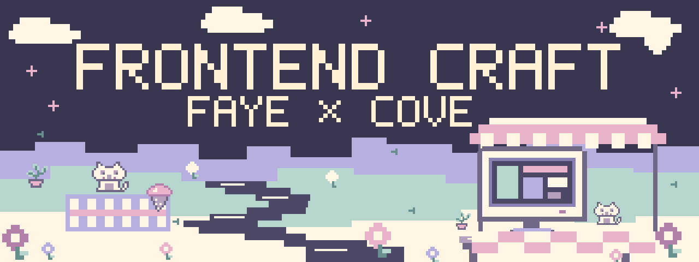
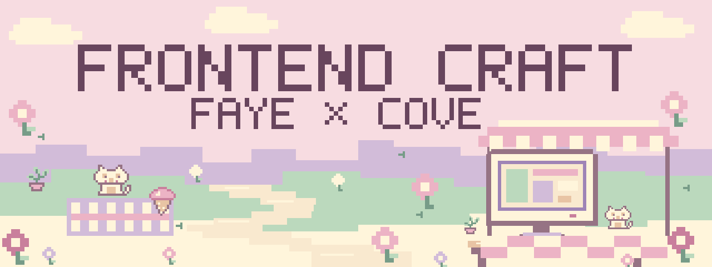

# Frontend Craft visual language

[English entrance](../../README.md) · [中文入口](../../README.zh-CN.md)

The canonical banner is an ice-cream-colored pixel landscape: a little brook,
a picnic blanket, cats, and a tiny creative workspace. **Frontend Craft** is
the scene title, with **Faye × Cove** as its credit.

This is the repository's own visual identity. FC's product work should follow
each project's intent and design authority. The [interactive style gallery](../../examples/showcase/README.md)
deliberately shows different compositions and interactions.

## Pixel banner collection

**Canon — vanilla, strawberry, mint, and lilac.**


**Moon — blueberry night with soft cream light.**



**Garden — strawberry cream and small pixel flowers.**



All three are 1280 × 480 SVGs, drawn from repository-owned pixel glyphs,
sprites, coordinates, and palettes in
[`scripts/render_banners.py`](../../scripts/render_banners.py). They use no
image model, raster input, external assets, fonts, or network requests.
The full-name lettering is an authored bitmap alphabet rendered as vector
pixel paths; accessible titles and descriptions provide its text equivalent.
The same brand lettering is used in both README editions.

To edit a banner, change its source and regenerate all three exports:

```bash
python3 scripts/render_banners.py
```

The palette uses vanilla `#FFF3E2`, blueberry ink `#493E68`, strawberry
`#F2B8C8`, mint `#B7DACD`, and lilac `#C5B9DF`. Dark ink carries the title;
the pale colors carry landscape and detail. Keep the scene readable at the
actual embed width. At 360 CSS pixels, the title is about 23.6 pixels high and
the author credit 15.8 pixels high; decorative sprites contain no essential
instructions.

## Architecture and browser previews

The architecture diagram uses a quieter version of the same color family:
cream ground, plum relationships, and a pale lilac package region. Text stays
live and connectors stay explicit. It is designed to remain readable at a
minimum embed width of 360 CSS pixels.

| Asset | English | Chinese |
| --- | --- | --- |
| Architecture, 960 × 1470 | [SVG](architecture.en.svg) | [SVG](architecture.zh-CN.svg) |
| Note-editor workflow | [PNG](workflow-preview.en.png) | [PNG](workflow-preview.zh-CN.png) |
| Soft Scoop | [PNG](showcase-scoop.en.png) | [PNG](showcase-scoop.zh-CN.png) |
| Offscreen | [PNG](showcase-offscreen.en.png) | [PNG](showcase-offscreen.zh-CN.png) |
| Chromatic Field | [PNG](showcase-field.en.png) | [PNG](showcase-field.zh-CN.png) |

The architecture SVGs are directly editable sources. After changes, inspect
both languages at full size, at the intended embed width, and in grayscale.
Syntax validity alone does not establish legibility or correct relationships.

Preview PNGs are actual browser captures of the
[workflow](../../examples/workflow/README.md) and
[style gallery](../../examples/showcase/README.md). Their HTML/CSS/JS is the
source: change the application first, then recapture its preview. Do not paint
or generate a screenshot that the application cannot reproduce.

## What the architecture says

The diagram is a conceptual guide to authority and interaction, not an automatic
execution pipeline. The three method groups are a summary, not a required
sequence or an exhaustive file inventory. The host agent chooses relevant
instructions and performs authorized actions with its available tools.

| Visual relationship | Current source |
| --- | --- |
| Current request, accepted design, and repository/runtime evidence guide the work | [SKILL.md: core contract and working method](../../SKILL.md) |
| One router loads focused methods only when needed | [SKILL.md: routing](../../SKILL.md), [method navigation](../../README.md#method-navigation) |
| The host changes the real product and checks rendered behavior; revisions return to the applicable method | [Build](../../references/build.md), [critique and revision](../../references/critique-revision.md), [QA contract](../../references/qa-contract.md) |
| Optional local context and bounded case retrieval support the host | [Local helper](../../scripts/fc_memory.py), [memory operations](../../references/memory-operations.md) |
| Optional authorized Cloudflare use sends allowlisted case text and natural-language queries; its index is derived | [Cloudflare helper](../../scripts/fc_cloudflare.py), [Cloudflare memory](../../references/cloudflare-memory.md) |

The case embedding allowlist is `title`, `statement`, `next_action`, `keywords`,
and `limits`. Current context and evidence pointers stay local. The dashed
connector represents the optional outbound boundary, not upload of the whole
case file. The diagram does not promise automatic setup, retrieval, updates,
instruction enforcement, design quality, or owner acceptance.

## 中文说明

Canon 是冰淇淋色系的像素小世界：奶油天空、薄荷和香芋色的地形、小溪、野餐毯、猫猫与小工作台。Frontend Craft 是场景标题，Faye × Cove 是署名。Moon 与 Garden 是同一像素世界的可选版本。

三张 banner 都由仓库中的 Python 标准库脚本绘制，字形、sprite、坐标与配色可以直接修改。不使用 ImageGen、外部图片或字体。修改源脚本后重新生成 SVG，不把导出图当另一套源。架构图则保持原生 SVG 文字与明确的关系线，源文件可直接编辑。

架构图表示方法引导与反馈关系，不是强制流水线。下方本地记录与 Cloudflare 均为可选路径；只有经授权的白名单案例文本与查询可以传出，当前上下文与证据指针留在本地。实际 demo 和风格展示的截图须从真实页面重新捕获。

Original artwork and explanatory assets: **Frontend Craft — Faye & Cove**,
under [CC BY-NC-SA 4.0](../../LICENSE-DOCUMENTATION.md). Functional rendering
scripts and demos are covered separately in the [license map](../../LICENSING.md).
