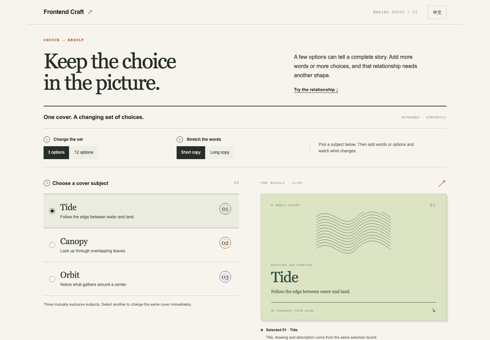
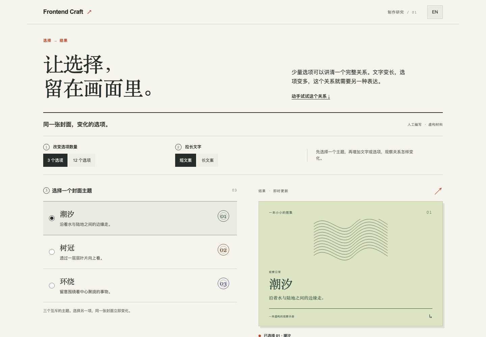

# Three small worlds

Three authored, synthetic frontend examples show different compositions and
working interactions. They are not a quality benchmark or evidence of an
autonomous Frontend Craft run.

- **Soft Scoop** is a warm pixel-art ice-cream shop. Choose one of three
  flavors and 1–6 cones; the original SVG ice cream, item description, and
  illustrative USD total update together. There is no checkout, order, or
  payment operation.
- **Offscreen** is an editorial reading journal. Select and read any of three
  original fictional essays, or continue with “Read the next essay.” The
  English and Chinese versions both contain the complete essays.
- **Chromatic Field** is a dark generative visual studio. Set the line density
  from 24–88, create a new repeatable procedural variation, and pause or resume
  the wave. Geometry and color change with each variation. Motion starts
  paused when the system requests reduced motion; it can be explicitly
  resumed. Hidden scenes and background tabs stop their animation work.

The gallery’s English/Chinese switch translates the interface and article
content. Flavor, quantity, selected essay, and visual-studio settings survive
scene and language changes in the current page. Reloading resets them. Nothing
is written to browser storage.

## Run locally

Run this command from the repository root:

```sh
python3 -m http.server 4182 --bind 127.0.0.1
```

Then open [the gallery](http://127.0.0.1:4182/examples/showcase/). The gallery also
links to the separate [note workflow](../workflow/).

Directly opening [index.html](index.html) depends on your browser's `file://`
policy. The loopback HTTP route above is the verified preview path.

The page uses local HTML, CSS, JavaScript, inline SVG, and system fonts. It has
no packages to install, external assets, model calls, analytics, network APIs,
audio, accounts, or live shop. No ImageGen is used. The optional HTTP server
serves files from your machine over loopback.

Source files are `index.html` (semantic scenes), `styles.css` (three visual
systems and responsive layouts), and `app.js` (translations, original essays,
in-memory state, and the procedural line field). A syntax check is:

```sh
node --check examples/showcase/app.js
```

## Making study: choice and result

Open the [interactive study](studies/choice-and-result/index.html), served at
[the local study URL](http://127.0.0.1:4182/examples/showcase/studies/choice-and-result/)
with the same server command above. This is a focused making reference, separate
from the three gallery scenes.

| English, 1440 × 1000 | 中文，1440 × 1000 |
| --- | --- |
| [](studies/choice-and-result/index.html) | [](studies/choice-and-result/index.html) |

**Problem:** a person needs to compare a few options and understand what their
selection changes. Soft Scoop supplies an inspectable example: its native
flavor group, selected item, description, illustration, and total stay related.
The study borrows that relationship, not the ice-cream theme or pixel styling.

Try a selection, change the content length, then increase the option set and
inspect the result at a narrow width. The useful mechanism is visible comparison
with nearby feedback. It works while the differences fit a readable working
area; long descriptions and larger sets can push the result away. A compact
chooser reduces that distance at the cost of hiding simultaneous comparison.
Inspect the actual alternatives rather than treating a particular option count
as a universal breakpoint or an expanded radio group as always superior.

Source: [structure](studies/choice-and-result/index.html),
[layout](studies/choice-and-result/styles.css), and
[state and content](studies/choice-and-result/app.js). The study has paired
English/Chinese content, uses only page-local state, and resets on reload.
Switching language or presentation preserves selection. Returning from twelve
options to three retains an available subject, otherwise it selects Tide.
On narrow screens the compact live result stays above the choices; long
English text can use about a third of the tested 390 × 844 viewport.
It has no backend, external assets, model calls, or storage writes. Its
synthetic content and construction choices are teaching material, not a
quality benchmark, recorded user preference, or owner-approved visual style.

**中文制作参考：选项与结果。** 使用上面的同一本地服务打开
[交互研究页](studies/choice-and-result/index.html)。它研究少量选项的可见比较与即时结果之间的关系，取材于 Soft Scoop 的口味选择、说明、图形与总价联动，不移植冰淇淋主题或像素皮肤。

先选择一个选项，再换成长文案、增加选项，并在窄屏检查结果。展开选择适合差异能在可读的操作范围内共同呈现的情况；长说明与较多选项可能把结果推远。紧凑选择减少占用，但会牺牲同时比较。请观察具体内容与实际渲染，不把某个数量当作通用阈值，也不把 radio 当作固定答案。上方链接可查看结构、布局和状态源码。切换语言或呈现方式保留选择；从十二项回到三项时，会保留仍在集合中的主题，否则选中“潮汐”。窄屏上的精简结果留在选项上方，最长英文内容约占已测 390 × 844 视口的三分之一。页面英中配对，只有页内状态，刷新重置；无后端、外部素材、模型调用或存储写入。合成材料用于解释制作机制，不构成质量评测、用户偏好记录或已被用户接受的视觉风格。

## 中文说明

这里有三个人工编写的虚构前端示例，用不同的构图与真实可操作的交互，展示界面设计的变化范围。它们并非质量基准，也不代表 Frontend Craft 自主运行的成果。

- **Soft Scoop**：暖色像素冰淇淋小店。选择三种口味之一与 1–6 支甜筒，原创 SVG 冰淇淋、口味说明和示例美元总价会同步变化。没有结账、下单或支付。
- **Offscreen**：注重文字排版的阅读小刊。三篇原创虚构随笔都可以选中并阅读全文，也可以点击“读下一篇”。中英文都有完整正文。
- **Chromatic Field**：深色生成艺术工作台。可以把线条密度设为 24–88，生成新的可重复程序变化，或暂停与继续波浪流动。每次变化都会改变几何形态与颜色。系统启用“减少动态效果”时默认暂停，用户仍可主动继续；隐藏场景与后台标签页会停止动画计算。

页面的中英文切换会翻译界面和文章。切换场景或语言时，口味、数量、文章选择和线场设置都会保留在当前页面会话中；刷新页面后恢复默认，不写入浏览器存储。

在仓库根目录运行上面的 Python 命令，再访问[本地画廊](http://127.0.0.1:4182/examples/showcase/)。画廊内有通往独立[笔记工作流](../workflow/)的链接。直接打开 [index.html](index.html) 取决于浏览器的 `file://` 策略；已经验证的是上述本机 HTTP 预览路径。

页面仅使用本地 HTML、CSS、JavaScript、内联 SVG 和系统字体，无需安装依赖；没有外部素材、模型调用、统计追踪、网络 API、音频、账号或真实商店，也没有使用 ImageGen。可选的 HTTP 服务仅通过本机回环地址提供文件。
