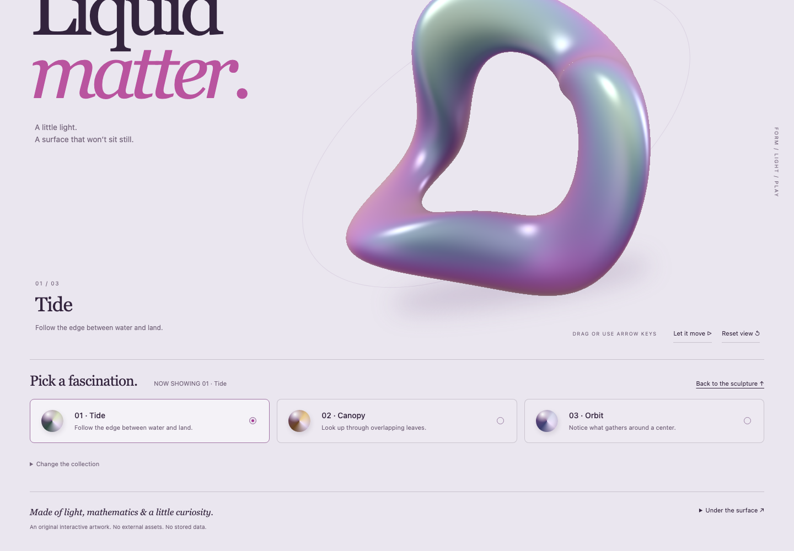
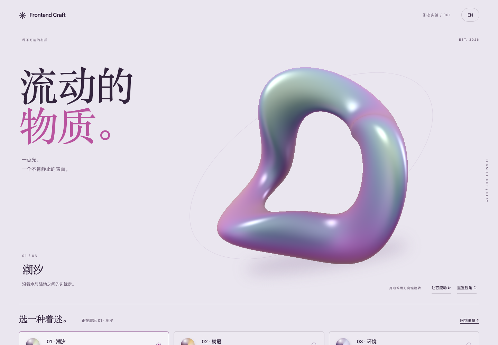

# Three small worlds

Three authored, synthetic frontend examples show different compositions and
working interactions. They are not a quality benchmark or evidence of an
autonomous Frontend Craft run.

- **Soft Scoop** is a warm pixel-art ice-cream shop. Choose one of three
  flavors and 1–6 cones; the original SVG ice cream, item description, and
  illustrative USD total update together. There is no checkout, order, or
  payment operation.
- **Offscreen** is an editorial reading journal. Select and read any of three
  original fictional essays, or continue with “Read the next essay.” The
  English and Chinese versions both contain the complete essays.
- **Chromatic Field** is a dark generative visual studio. Set the line density
  from 24–88, create a new repeatable procedural variation, and pause or resume
  the wave. Geometry and color change with each variation. Motion starts
  paused when the system requests reduced motion; it can be explicitly
  resumed. Hidden scenes and background tabs stop their animation work.

The gallery’s English/Chinese switch translates the interface and article
content. Flavor, quantity, selected essay, and visual-studio settings survive
scene and language changes in the current page. Reloading resets them. Nothing
is written to browser storage.

## Run locally

Run this command from the repository root:

```sh
python3 -m http.server 4182 --bind 127.0.0.1
```

Then open [the gallery](http://127.0.0.1:4182/examples/showcase/). The gallery also
links to the separate [note workflow](../workflow/).

Directly opening [index.html](index.html) depends on your browser's `file://`
policy. The loopback HTTP route above is the verified preview path.

The page uses local HTML, CSS, JavaScript, inline SVG, and system fonts. It has
no packages to install, external assets, model calls, analytics, network APIs,
audio, accounts, or live shop. No ImageGen is used. The optional HTTP server
serves files from your machine over loopback.

Source files are `index.html` (semantic scenes), `styles.css` (three visual
systems and responsive layouts), and `app.js` (translations, original essays,
in-memory state, and the procedural line field). A syntax check is:

```sh
node --check examples/showcase/app.js
```

## Making study: choice and result

**Liquid Matter** is a standalone interactive artwork: an iridescent folded
sculpture, large expressive typography, and a small collection of variations.
Open [the work](studies/choice-and-result/index.html) at
[its local URL](http://127.0.0.1:4182/examples/showcase/studies/choice-and-result/)
using the server above. Drag or use the arrow keys on the sculpture to turn it,
pause its motion, or reset the view.

| English, 1440 × 1000 | 中文，1440 × 1000 |
| --- | --- |
| [](studies/choice-and-result/index.html) | [](studies/choice-and-result/index.html) |

The artwork leads; optional **Change the collection** settings expose the
underlying choice-and-result experiment. Try three or twelve subjects, short
or long titles, and visible choices versus a compact menu. Each selected ID
drives the sculpture variation, name and description. Language and presentation
changes keep selection; reducing twelve subjects to three retains an available
subject, otherwise selects Tide. Reload resets the page. The twelve subjects
are variations of one authored sculpture system, not twelve independent scenes.

WebGL draws the geometry and imagined reflective material at runtime; no model,
image, font, library, or other asset is downloaded. The material is an artistic
interpretation, not a physically accurate simulation. Motion starts paused for
reduced-motion preferences, can be explicitly resumed, and stops drawing while
the work is offscreen or the page is hidden. If WebGL is unavailable, the page
reports that limitation and keeps the collection's text usable; it cannot show
the sculpture. There is no backend, storage, model call, or sound.

The original [Soft Scoop](index.html) selection/result relationship remains a
useful mechanism. Compact presentation saves space but hides alternatives;
large visible sets require scrolling. The work's details and selected-description
text remain available, but this does not make every alternative simultaneously
visible. Source and reproduction details are in the
[work's guide](studies/choice-and-result/README.md). This is authored demonstration
work, not an autonomous FC benchmark or a record of owner aesthetic acceptance.

**中文：流动的物质。** 打开[作品](studies/choice-and-result/index.html)，拖动或用方向键旋转虹彩雕塑，也可以暂停运动、重置视角。画面以作品为中心；下方“调整作品集合”可切换三/十二个主题、长短标题、展开选项/紧凑菜单。一个选中 ID 同时决定形态变化、名称与说明，语言与呈现方式切换保留选择。从十二项回到三项时保留仍在集合中的主题，否则选择“潮汐”；刷新重置。十二个主题是同一套雕塑系统的变化，不是十二个独立场景。

WebGL 实时绘制形体与想象中的反光材质；不下载模型、图片、字体或依赖。材质属于艺术表达，不是物理模拟。系统要求减少动态时默认暂停，仍可主动播放；作品离开视口或页面隐藏时停止绘制。WebGL 不可用时会明确说明，文字集合仍可操作，雕塑无法显示。无后端、存储、模型调用或声音。紧凑菜单节省空间，也隐藏了同时比较的选项；源码机制与复现说明见[作品说明](studies/choice-and-result/README.md)。这是有指导制作的展示作品，不代表自主首稿质量，也不构成用户审美验收记录。

## 中文说明

这里有三个人工编写的虚构前端示例，用不同的构图与真实可操作的交互，展示界面设计的变化范围。它们并非质量基准，也不代表 Frontend Craft 自主运行的成果。

- **Soft Scoop**：暖色像素冰淇淋小店。选择三种口味之一与 1–6 支甜筒，原创 SVG 冰淇淋、口味说明和示例美元总价会同步变化。没有结账、下单或支付。
- **Offscreen**：注重文字排版的阅读小刊。三篇原创虚构随笔都可以选中并阅读全文，也可以点击“读下一篇”。中英文都有完整正文。
- **Chromatic Field**：深色生成艺术工作台。可以把线条密度设为 24–88，生成新的可重复程序变化，或暂停与继续波浪流动。每次变化都会改变几何形态与颜色。系统启用“减少动态效果”时默认暂停，用户仍可主动继续；隐藏场景与后台标签页会停止动画计算。

页面的中英文切换会翻译界面和文章。切换场景或语言时，口味、数量、文章选择和线场设置都会保留在当前页面会话中；刷新页面后恢复默认，不写入浏览器存储。

在仓库根目录运行上面的 Python 命令，再访问[本地画廊](http://127.0.0.1:4182/examples/showcase/)。画廊内有通往独立[笔记工作流](../workflow/)的链接。直接打开 [index.html](index.html) 取决于浏览器的 `file://` 策略；已经验证的是上述本机 HTTP 预览路径。

页面仅使用本地 HTML、CSS、JavaScript、内联 SVG 和系统字体，无需安装依赖；没有外部素材、模型调用、统计追踪、网络 API、音频、账号或真实商店，也没有使用 ImageGen。可选的 HTTP 服务仅通过本机回环地址提供文件。
